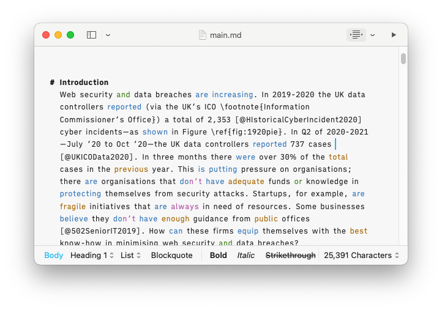

# Academic writing in Markdown
Write in markdown and convert to Latex and finally PDF.

Whilst latex is great, writing in raw latex is troublesome and slow. Softwares
like iA Writer provide an efficient and safe means of writing.

Managing citations is the annoying part in writing. Thanks to Zotero and a plugin
called Better BibTeX for Zotero you can automatically fetch your citations once
you compile your writing into latex (and pdf). So, add you citation to Zotero
and once you do that it will give you a Citation Key that you can include in
your writing. You will have to amend the make file to the right place to ensure
the right citations are pulled from Zotero.

The template currently used is the IEEEtemplate.

Write in iA Writer (or any other editor of your choice) then convert to Latex
and PDF.

### Requirements
* Pandoc
* Zotero (for references)
    * Better BibTe for Zotero (plugin)

Edit the makefile to include your own Zotero link. Then running the makefile
should hopefully output the docs into the build folder.
`
$ make
`
Works on Arch Linux and MacOS (Silicon and Intel). Not tested on other systems. 

### TO DO
* Alternative templates.
* Cleaner IEEE template.

Author: Sirvan Almasi @ Imperial College London
